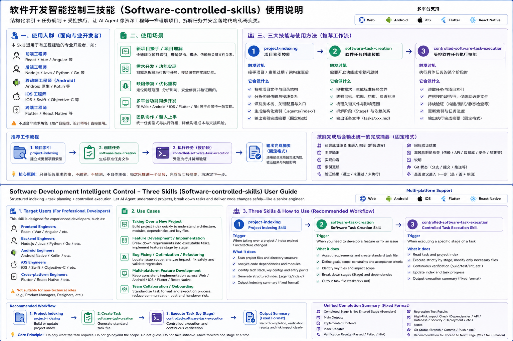

# Software Controlled Skills 中文说明

[English README](README.md)

这是一个面向多平台软件开发的受控 Skill 包，用于帮助 AI Agent 在开发过程中保持任务边界清晰、项目索引可追踪、阶段结果可审计。

当前版本为 `2.1.0`，主要适配 Codex 风格 Agent、Claude Code、Trae 和 Cursor。



## 项目内容

- `core/`：三个核心 Skill 的标准定义。
- `.agents/skills/`：通用 Agent / Codex 兼容的 Skill 目录。
- `.claude/skills/`：Claude Code 使用的 Skill 目录。
- `.cursor/rules/`：Cursor 规则文件。
- `.trae/rules/`：Trae 项目规则。
- `tasks/`：任务 prompt 模板。
- `examples/`：阶段完成摘要示例。
- `docs/ai-index/_templates/`：多平台项目索引模板。
- `USAGE.md`：更详细的中文使用指南。
- `manifest.json`：包元数据。

## 三个核心 Skill

### `project-indexing`

用于初始化项目索引、全量重建索引和索引审计。它会帮助 Agent 识别项目结构、平台类型、关键模块和后续开发需要关注的文件。

### `software-task-creation`

用于把用户的原始需求整理成可以交给 Agent 执行的任务 prompt。它会把目标、范围、限制、验收标准和完成摘要要求写清楚，降低任务执行时跑偏的概率。

### `controlled-software-task-execution`

用于执行受控的软件开发任务。执行前会进行轻量索引检查，执行后会按要求更新索引，并输出固定格式的开发完成摘要。

## 推荐工作流

第一次接入一个项目时，先让 Agent 使用 `project-indexing` 初始化索引：

```text
使用 project-indexing 初始化当前项目索引。
请识别项目类型和平台，创建 docs/ai-index/ 下的相关索引。
本次只做索引，不做功能开发。
完成后按索引完成摘要格式输出。
```

当你有一个需求但还没有整理成开发任务时，使用 `software-task-creation`：

```text
使用 software-task-creation 帮我把以下需求整理成可交给 Agent 执行的任务 prompt：

需求：
...
项目类型：
...
限制：
...
```

执行具体开发任务时，使用 `controlled-software-task-execution`：

```text
使用 controlled-software-task-execution 执行以下任务。

索引策略：index-check

当前任务：
...

完成后必须按 Fixed Completion Summary Format 输出开发完成摘要。
```

## 安装方式

### Codex / 通用 Agent

```bash
cp -R .agents /path/to/project/
cp AGENTS.md /path/to/project/
cp -R tasks /path/to/project/
```

### Claude Code

```bash
mkdir -p /path/to/project/.claude/skills
cp -R .claude/skills/* /path/to/project/.claude/skills/
```

### Cursor

```bash
mkdir -p /path/to/project/.cursor/rules
cp .cursor/rules/*.mdc /path/to/project/.cursor/rules/
```

### Trae

```bash
mkdir -p /path/to/project/.trae/rules
cp .trae/rules/project_rules.md /path/to/project/.trae/rules/project_rules.md
```

## v2.1 更新

- 增加固定开发完成摘要格式。
- 增加索引完成摘要格式。
- 在任务创建 Skill 中加入强制完成摘要要求。
- 更新任务模板，明确阶段边界和验收摘要字段。

## 许可证

MIT。详见 `LICENSE`。
