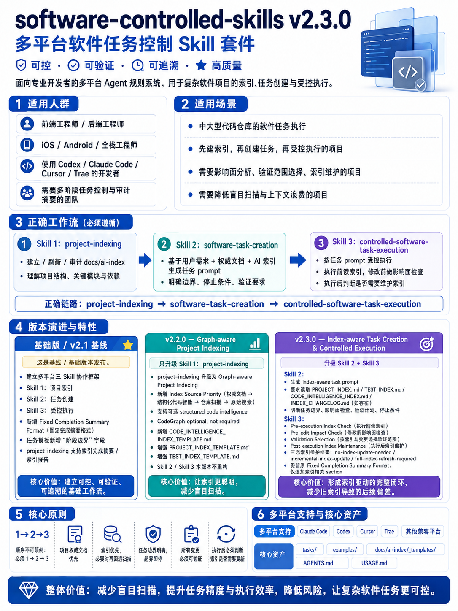

# Software Controlled Skills 中文说明

[English README](README.md)

这是一个面向多平台软件开发的受控 Skill 包，用于帮助 AI Agent 在开发过程中保持任务边界清晰、项目索引可追踪、阶段结果可审计。

当前版本为 `2.3.0`，主要适配 Codex 风格 Agent、Claude Code、Trae 和 Cursor。



## 项目内容

- `core/`：三个核心 Skill 的标准定义。
- `.agents/skills/`：通用 Agent / Codex 兼容的 Skill 目录。
- `.claude/skills/`：Claude Code 使用的 Skill 目录。
- `.cursor/rules/`：Cursor 规则文件。
- `.trae/rules/`：Trae 项目规则。
- `tasks/`：任务 prompt 模板。
- `examples/`：阶段完成摘要示例。
- `docs/ai-index/_templates/`：多平台项目索引模板。
- `USAGE.md`：更详细的中文使用指南。
- `manifest.json`：包元数据。

## 三个核心 Skill

### `project-indexing`

用于初始化项目索引、全量重建索引和索引审计。v2.2.0 将它升级为 Graph-aware / Code-intelligence-aware Project Indexing Skill，会帮助 Agent 识别项目结构、平台类型、关键入口、关键 symbol / module、dependency graph 摘要、critical flows 和 affected tests 映射。

CodeGraph 和其他 code graph MCP tools 只是可选结构化代码智能来源。本包不会安装 CodeGraph，不会初始化 `.codegraph/`，不会新增依赖、npm script 或 MCP 配置，也不会要求所有项目必须使用代码图谱。`AGENTS.md`、`CLAUDE.md`、`README`、`docs/`、`tasks/`、`manifest.json` 等项目权威文档始终高于代码图谱。

### `software-task-creation`

用于把用户的原始需求整理成可以交给 Agent 执行的任务 prompt。v2.3.0 将它增强为 index-aware task creation，会把目标、范围、限制、AI index files to read、Pre-edit Impact Check、affected tests mapping、验证计划、索引维护预期和完成摘要要求写清楚，降低任务执行时跑偏的概率。

### `controlled-software-task-execution`

用于执行受控的软件开发任务。v2.3.0 将它增强为 index-aware controlled execution：执行前解析任务 prompt、读取索引并判断边界，修改前做影响面检查，验证时参考 TEST_INDEX.md / CODE_INTELLIGENCE_INDEX.md / package scripts / changed files，执行后判断 docs/ai-index 是否需要 no-index-update-needed、incremental-index-update 或 full-index-refresh-required，并输出固定格式的开发完成摘要。

## 推荐工作流

正确链路：

```text
project-indexing -> software-task-creation -> controlled-software-task-execution
```

Workflow: project-indexing -> software-task-creation -> controlled-software-task-execution.

第一次接入一个项目时，先让 Agent 使用 `project-indexing` 初始化索引：

```text
使用 project-indexing 初始化当前项目索引。
请识别项目类型和平台，创建 docs/ai-index/ 下的相关索引。
本次只做索引，不做功能开发。
完成后按索引完成摘要格式输出。
```

当你有一个需求但还没有整理成开发任务时，使用 `software-task-creation`：

```text
使用 software-task-creation 帮我把以下需求整理成可交给 Agent 执行的任务 prompt：

需求：
...
项目类型：
...
限制：
...

要求：
请生成索引感知型任务 prompt，要求执行 Agent 读取项目权威文档和已有 docs/ai-index，明确 allowed / forbidden 范围、Pre-edit Impact Check、Validation plan 和 Post-execution index maintenance。
```

执行具体开发任务时，使用 `controlled-software-task-execution`：

```text
使用 controlled-software-task-execution 执行以下任务。

索引策略：index-check

当前任务：
...

完成后必须按 Fixed Completion Summary Format 输出开发完成摘要。
完成后必须判断是否需要更新 docs/ai-index；如果需要 project-indexing refresh / rebuild 且未完成，不应建议进入下一步。
```

## 安装方式

### Codex / 通用 Agent

```bash
cp -R .agents /path/to/project/
cp AGENTS.md /path/to/project/
cp -R tasks /path/to/project/
```

### Claude Code

```bash
mkdir -p /path/to/project/.claude/skills
cp -R .claude/skills/* /path/to/project/.claude/skills/
```

### Cursor

```bash
mkdir -p /path/to/project/.cursor/rules
cp .cursor/rules/*.mdc /path/to/project/.cursor/rules/
```

### Trae

```bash
mkdir -p /path/to/project/.trae/rules
cp .trae/rules/project_rules.md /path/to/project/.trae/rules/project_rules.md
```

## v2.2.0 — Graph-aware Project Indexing

- 仅升级 `project-indexing`，不重构另外两个核心 Skill。
- 新增 Index Source Priority：项目权威文档、已有 AI 索引、可选 structured code intelligence、仓库文件配置、fallback raw search。
- 新增 Structured Code Intelligence Detection：检测 `.codegraph/`、CodeGraph MCP tools、symbol / AST / call graph、dependency graph、test impact graph 和 graph freshness。
- 增强 `PROJECT_INDEX_TEMPLATE.md`：新增 index strategy、authority document sources、structured code intelligence availability、key entry points、key symbols / modules、dependency summary、critical flows、fallback reason 和 uncertainty log。
- 增强 `TEST_INDEX_TEMPLATE.md`：新增 source area 到 affected tests 的映射。
- 新增可选 `CODE_INTELLIGENCE_INDEX_TEMPLATE.md`。
- 普通项目没有 CodeGraph 时，仍然按现有 `docs/ai-index/` 流程完成索引。

## v2.3.0 — Index-aware Task Creation & Controlled Execution

- 不重构 `project-indexing`，保留 v2.2.0 graph-aware indexing。
- 增强 `software-task-creation`：生成任务 prompt 时要求读取项目权威文档、`PROJECT_INDEX.md`、`TEST_INDEX.md`、`CODE_INTELLIGENCE_INDEX.md`、`INDEX_CHANGELOG.md` 和平台索引，如存在。
- 增强 `controlled-software-task-execution`：执行前做 Pre-execution Index Check，修改前做 impact check，验证时按 TEST_INDEX.md、affected tests mapping、package scripts、changed files 和 README / docs 选择。
- 新增任务后索引维护判断：`no-index-update-needed`、`incremental-index-update`、`full-index-refresh-required`。
- 如果索引需要刷新但未完成，“是否建议进入下一步”应为“否”，除非用户明确要求跳过索引刷新。
- CodeGraph optional, not required；不新增依赖、不修改 package / CI。

## v2.1 更新

- 增加固定开发完成摘要格式。
- 增加索引完成摘要格式。
- 在任务创建 Skill 中加入强制完成摘要要求。
- 更新任务模板，明确阶段边界和验收摘要字段。

## 许可证

MIT。详见 `LICENSE`。
